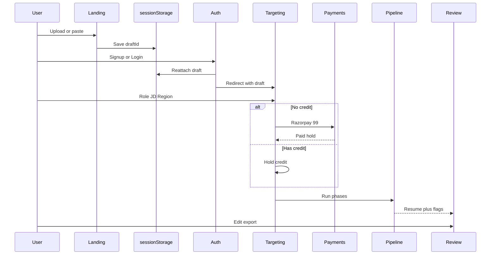

# HexaCV — LOGIC.md (Application Workflow & AI Pipeline)

Companion to `PLAN.md` §§3–8, `AGENT_TASKS.md`, `docs/ai/PIPELINE.md`.  
**Code anchors:** `server/ai/pipelineOrchestrator.ts`, `server/routers.ts`, `server/payments/razorpay.ts`, `server/razorpayWebhook.ts`, `server/contentValidation.ts`.

---

## 1. Entry flow state machine (PLAN §3)

```
Landing (/)
  │ paste / upload PDF|DOCX / start fresh
  ▼
sessionStorage draft (temp draftId) — NOT in DB yet
  │ Continue
  ▼
Auth check
  ├─ logged in → parsed-data review (if upload/paste) → Targeting
  └─ guest → Login/Register (draft preserved) → free credit on signup → Targeting
  ▼
Targeting (role + JD + region)
  ▼
Credit check
  ├─ credit > 0 → hold free/paid credit → Pipeline
  └─ credit = 0 → Razorpay ₹99 hold → Pipeline on success
  ▼
Pipeline (Extract→Target→Rewrite→Validate→Polish*)
  ├─ success → consume credit / confirm payment → Review
  └─ fail → auto-retry once → still fail → release hold, no charge
  ▼
Review & Edit (manual free / AI-assist metered)
  ▼
Export PDF + DOCX
```

\*Polish stage is specified in PLAN but **not built yet** in `pipelineOrchestrator` (see `docs/ai/PIPELINE.md`). Ship Extract→Target→Rewrite→Validate first; add Polish when template count (§10) is decided.

### Critical rule

Pre-auth draft **must survive** signup/login. Key by temp draft ID in `sessionStorage`; reattach on first authenticated write. Losing the upload after the user did the hard work is the #1 conversion killer.

---

## 2. Credit & payment states

| State | Meaning |
| --- | --- |
| `credit_free_available` | Signup grant of 1 free build not yet consumed |
| `credit_paid_balance` | Purchased / referral credits remaining |
| `hold_pending` | Credit or ₹99 reserved for in-flight generation |
| `draft_payment_pending` | User closed Razorpay; resume kept, unpaid |
| `paid` / `free_consumed` | Build unlocked; exports available forever from dashboard |
| `released` | Generation failed after retry — hold cleared, no charge |

### Rules

1. Pay-per-use only — ₹99 per **build** (one role + JD combination). No recurring billing in this flow.
2. First build free per account — granted once at signup, not monthly.
3. Manual edits always free.
4. Substantial Role/JD change after generation = new build = new credit.
5. AI section improves: included free pack then top-up — **BLOCKED (PLAN §10)** for price/count.
6. Failed generation never charges (retry once, then release).

---

## 3. Targeting logic (PLAN §4)

Inputs (max 3 competing fields):

1. **Region** — segmented control (final enum **BLOCKED §10**).
2. **Target Role** — suggestions after 3 chars, 250ms debounce; static local list first, then ranked by experience relevance.
3. **Job Description** — optional but recommended; must actually reweight Target/Rewrite keywords if the "2x better match" copy ships.

CTA labels (never "Submit" / "Generate"):

- Has credit: **Build my resume — free**
- No credit: **Build my resume — ₹99**

---

## 4. AI pipeline contract

### As-built today (`docs/ai/PIPELINE.md`)

| Stage | Code | Status |
| --- | --- | --- |
| Extract | `pipelineOrchestrator` + `fileParser` | Built (C1) |
| Target | `pipelineOrchestrator` | Built (C1) |
| Rewrite | `pipelineOrchestrator` + `prompt_versions` | Built (C1/C5) |
| Validate | `contentValidation` + deterministic eval + 1 rewrite retry | Built (C3) |
| Polish | — | Not built |

Feature LLM calls also live in `server/aiSuggestions.ts` (bullets, summary, ATS, cover letter, etc.) and must still obey grounding.

### Loader / UX phases (product)

Show all five phases as a vertical journey (PLAN §5). Do not fake progress bars or stretch cheap phases. Interpolate Role/Region into Target copy.

### Validate → Review handoff

Flagged lines enter Review in a **needs your check** state with amber markers. Never silently drop or keep unverified inventions.

---

## 5. Review & export logic

- Preview renders from the **same template engine** as PDF/DOCX export.
- Two edit paths: manual (free) vs Ask AI (AI-assist credit).
- JD keyword panel: found vs not-found — factual, not an ATS % score.
- Export: PDF and Word equal weight; filename `FirstName_LastName_TargetRole.{pdf|docx}`.
- Downloads remain available from Dashboard indefinitely for unlocked builds.

---

## 6. Referral logic (PLAN §9)

UI exists: `AffiliateSystem` at `/dashboard/affiliate` (nav currently "Affiliate Program").

Required product logic:

1. Rename to **Refer & Earn**.
2. Referrer earns **1 free build credit** when referred user completes first **paid** build (not signup).
3. Referred user still gets standard first-build-free only — no stacked freebies.
4. Reward value confirmation is **BLOCKED (§10)**.

---

## 7. Auth gating rules

| Action | Guest allowed? |
| --- | --- |
| Paste / upload / start draft | Yes |
| Run AI pipeline / save to account | No — force auth |
| Manual edit of owned resume | Auth required; always free |
| Download unlocked resume | Auth + paid/free-credit consumed |

---

## 8. Sequence diagram (happy path)


