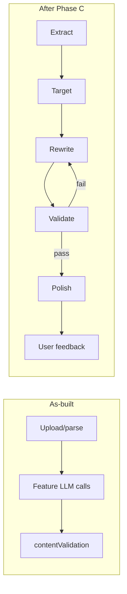

# HexaCV — AI Pipeline (as-built vs planned)

Prepared for: Anandu / HexaStack Solutions  
**Source of truth for pipeline stages.** Prefer this over older V2 diagrams when they disagree with code.

---

## Honest status (today)

There is **no** full 5-stage / self-improving agent loop.

What exists:

- Feature-shaped LLM calls (`aiSuggestions.ts`, `fileParser.ts`)
- **C1–C5** pipeline: Extract → Target → Rewrite → validate →
  deterministic evaluate + 1 retry; shared grounding; `userEdited`;
  `prompt_versions` (active rewrite prompt) + `resume_evaluations`
  (thumbs)
- Ordered provider failover in `server/_core/llm.ts`
- Kill switch `AI_PAUSED` on `ai.*` routes only (not `resume.parse`)
- **A2–A4** + **B1–B3** (`model_routing`, admin usage, spend/quotas)

What does **not** exist yet: Polish stage, full self-improving loop,
Clerk. Razorpay Orders checkout + webhook **shipped** (Stripe legacy).

## As-built call map

| User action | Code path | LLM? |
|---|---|---|
| Upload resume | `resume.parse` → `extractText` + `parseResumeWithLLM` | Yes (bypasses `AI_PAUSED`) |
| Full AI resume | `ai.generateFullResume` → `runResumePipeline` (extract→target→rewrite→C3 eval/retry) | Yes |
| Suggestions / bullets / summary / projects | `ai.*` → C2 helpers; editor applies with C4 `userEdited` merge | Yes |
| ATS score / audit / cover letter / LinkedIn / interview / outreach | `ai.*` → `aiSuggestions.ts` | Yes |
| Post-generation grounding | `contentValidation.ts` | No (rules only) |

---

## Planned stages (target after Phase C)

| Stage | Intent | Built today | Future |
|---|---|---|---|
| **1 Extract** | Cheap model, strict JSON facts from upload | **C1** — `pipelineOrchestrator` stage `extract` | Cost tier polish |
| **2 Target** | JD keywords + country ATS rules | **C1** — stage `target` | — |
| **3 Rewrite** | One structured rewrite | **C1** — stage `rewrite` (+ feature calls) | More entry points (C2) |
| **4 Validate** | Deterministic + evaluator; retry Rewrite once | **C3** + **C5** evals table (thumbs) | Polish / richer metrics UI |
| **5 Polish** | Premium model, paid tier | **Not built** | OpenAI premium path |

See also: [`MODELS_AND_KEYS.md`](./MODELS_AND_KEYS.md).

---

## Feedback / self-improvement (honest roadmap — not shipped)

Do **not** ship a “self-improving agent” without logs and evals.

1. ~~**A2–A4**~~ + ~~**B1–B3**~~ + ~~**C1–C5**~~ + ~~**F3**~~ + ~~**Razorpay primary**~~ + ~~**F4**~~ + ~~**G1–G3**~~ + ~~**F5**~~ — next: **R1** referral decision ([`docs/tasks/NEXT.md`](../tasks/NEXT.md)).
2. **Evaluator** — Stage 4 scores + banned-phrase checks; one Rewrite retry on fail (V2 §3).
3. **User feedback** — thumbs / “bad output” → `resume_evaluations` ([`PROMPT_AND_FEEDBACK_RULES.md`](./PROMPT_AND_FEEDBACK_RULES.md)); no outcome guarantees.
4. **Prompt versions** — `prompt_versions` table; no silent prompt drift.
5. **Admin** — CRM toggle for `AI_PAUSED`; usage panel from `usage_logs`.

---

## Ordered next code work

1. ~~**A2–A4**~~ — done
2. ~~**B1–B2**~~ — `model_routing` + admin usage/routing tab done
3. ~~**F3**~~ Stripe webhook idempotency — done (legacy)
4. ~~**Razorpay primary**~~ — orders + verify + webhook — done
5. ~~**F4**~~ subscription grace — done (`graceUntil`, 3 days)
6. ~~**G1–G3**~~ legal placeholders + ~~**F5**~~ refund — done; next R1/R2 ([`docs/tasks/NEXT.md`](../tasks/NEXT.md))
4. Phase C evaluator + feedback UI
