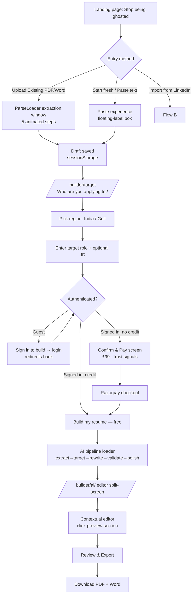
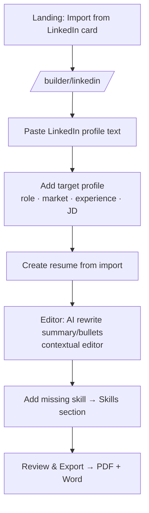
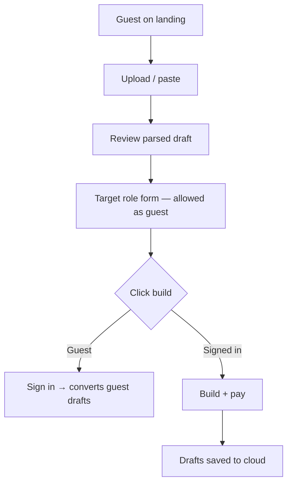
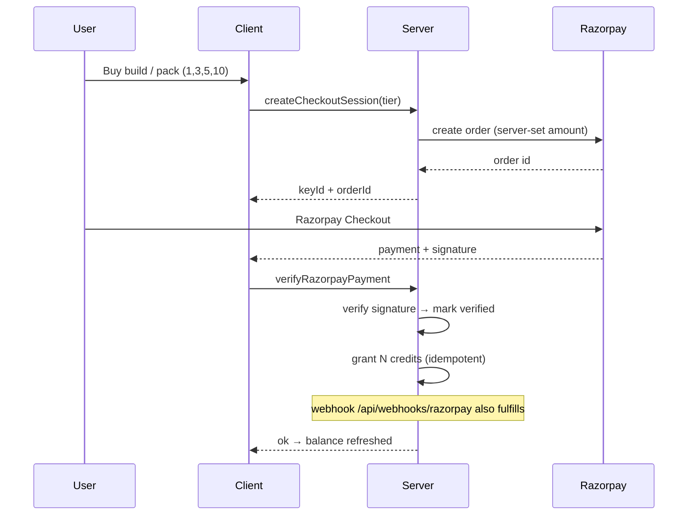
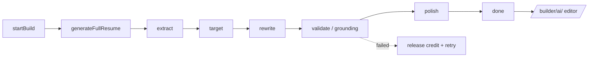

# End-to-End Workflows

Complete user journeys through HexaCV. Each workflow links to the feature files that
implement it. Status reflects the current implementation.

---

## Flow A — The "Ghosted" Job Seeker (New User)

**Goal:** convert an uploaded resume into an ATS-ready, target-tailored resume and pay for it.

**Steps**
1. **Landing** — pain-point headline, real resume preview, entry cards
   ([landing.md](landing.md)).
2. **Upload** → **ParseLoader** extraction window (min ~1.6s, 5 steps), draft saved to
   sessionStorage ([upload-and-extraction.md](upload-and-extraction.md)).
3. **Target** — region, target role (suggestions), optional JD
   ([targeting.md](targeting.md)).
4. **Sign in at the build step** — guests are routed to login; sign-in returns to
   targeting ([auth-and-guest.md](auth-and-guest.md)).
5. **Pay** — free first build (credit) or **Confirm & Pay** ₹99 via Razorpay
   ([billing-credits.md](billing-credits.md)).
6. **AI build** — phased PipelineLoader, grounded generation
   ([ai-pipeline.md](ai-pipeline.md), [grounding-validation.md](grounding-validation.md)).
7. **Review & edit** — split-screen editor + **contextual editor** slide-out
   ([resume-editor.md](resume-editor.md), [contextual-editor.md](contextual-editor.md)).
8. **Export** — PDF + Word ([export.md](export.md)).

---

## Flow B — The LinkedIn Importer

**Goal:** import profile text, structure + rewrite it for a target role, and export.

**Steps**
1. Landing **LinkedIn card** → `/builder/linkedin`
   ([landing.md](landing.md)).
2. Paste the profile into `ResumeLinkedInImporter`
   (builder mode, [resume-editor.md](resume-editor.md)).
3. Set a target profile via the `TargetPanel` (market + role + JD).
4. The AI structures and rewrites the text for the role
   ([ai-pipeline.md](ai-pipeline.md)).
5. Edit in the wizard or the **contextual editor** (click "Skills" in the preview → add
   skills inline).
6. Export ([export.md](export.md)).

---

## Guest-mode workflow

**Goal:** use the whole funnel without an account; sign in only at the build/payment step.

**Rules (NEW fix)**
- `guestHref` never routes a guest to an auth-gated page (`/dashboard/*`, `/admin`,
  `/url`) — prevents the login loop ([auth-and-guest.md](auth-and-guest.md)).
- Guests store up to **3 resumes** locally (`hexacv_local_resumes`); sign-in migrates
  them via `syncGuestDataToCloud`.
- The guest can fill the targeting form; "Sign in to build your resume" is the gate.

---

## Billing & credits workflow

**Key invariants** — server owns prices & credit grants; grants are idempotent per order;
no credit used if a build fails ([billing-credits.md](billing-credits.md)).

---

## AI pipeline workflow

Loader surfaces each stage in real time; `buildStatus` is polled every second
([ai-pipeline.md](ai-pipeline.md)).

---

## Flow reference map

| Workflow | Entry | Key route | Exit |
|----------|-------|-----------|------|
| Flow A (upload) | Landing upload card | `/builder/target` | Download |
| Flow B (LinkedIn) | Landing LinkedIn card | `/builder/linkedin` | Download |
| Guest | any entry | `/builder/*` | sign-in at build |
| Payment | Confirm & Pay / BillingPortal | `/dashboard/billing` | credits added |
| Export | Editor "Review & Export" | editor | PDF + Word |
